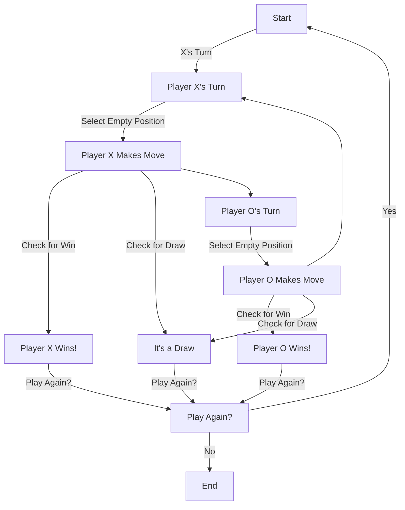

# Tic-Tac-Toe
Tic Tac Toe - Computer vs human

**INTRODUCTION**

This is a tic tac toe game which has the two users as - Computer and Human

**Flow Diagram**

```mermaid
graph TD;
    Start[Start] --> |"X's Turn"| XTurn[Player X's Turn];
    XTurn --> |"Select Empty Position"| XMove[Player X Makes Move];
    XMove --> |"Check for Win"| XWin[Player X Wins!];
    XMove --> |"Check for Draw"| Draw[It's a Draw];
    XMove --> OTurn[Player O's Turn];
    
    OTurn --> |"Select Empty Position"| OMove[Player O Makes Move];
    OMove --> |"Check for Win"| OWin[Player O Wins!];
    OMove --> |"Check for Draw"| Draw;
    OMove --> XTurn;

    XWin --> |"Play Again?"| PlayAgain[Play Again?];
    OWin --> |"Play Again?"| PlayAgain;
    Draw --> |"Play Again?"| PlayAgain;
    PlayAgain --> |Yes| Start;
    PlayAgain --> |No| End[End];

```
